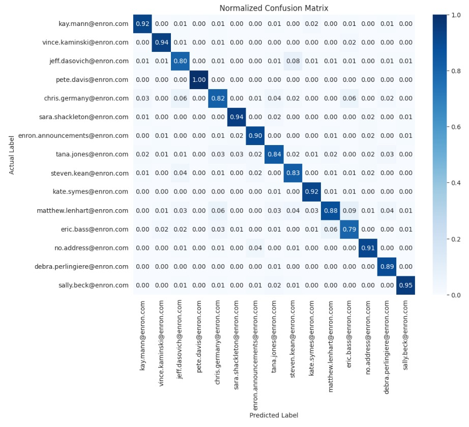

# EmailMind: Email Sender Prediction using Enron Email Dataset

## 1. Overview

This project focuses on the implementation and evaluation of various sender prediction models using the Enron Email Dataset. Leveraging machine learning techniques, the goal is to predict senders based on the content within the email body. In response to the increasing need for robust email security measures, especially against unauthorized access and phishing, this project delves into predictive modeling using a dataset containing half a million messages from top-tier management.

## 2. Implemented Models

The implemented sender prediction models include Naive Bayes, CNN, LSTM, and Bidirectional GRU.

## 3. Technology Stack

### 3.1 Programming Languages
- Python

### 3.2 Libraries/Frameworks
- Scikit-learn: Utilized for implementing machine learning models and evaluation.
- TensorFlow/Keras: Employed for building and training the neural network model.

### 3.3 Model Comparison

The performance of the implemented models was compared based on metrics such as Accuracy, Precision, Recall, and F1 Score.

## 4. Project Structure

The results of the model comparison are summarized in Table 1:

```
| Model                | Accuracy | Precision | Recall | F1 Score |
|----------------------|----------|-----------|--------|----------|
| Naive Bayes          | 0.69     | 0.69      | 0.69   | 0.7      |
| LSTM                 | 0.68     | 0.67      | 0.66   | 0.66     |
| CNN                  | 0.84     | 0.85      | 0.84   | 0.84     |
| Bidirectional GRU    | 0.89     | 0.89      | 0.89   | 0.89     |
```

## 5. Interesting Results



In-depth performance evaluation involved examining the confusion matrix, revealing valuable insights into the model's predictions, particularly when dealing with the top 15 email senders. The Bidirectional GRU network demonstrated a robust accuracy of 88%, achieving correctness in predictions for at least 88% of the cases.

## 6. Code Execution

To run the code:

1. Clone the repository: `git clone https://github.com/your-username/email-sender-prediction.git`
2. Navigate to the project directory: `cd email-sender-prediction`
3. Install dependencies: `pip install -r requirements.txt`
4. Run the model evaluation script: `python evaluation/evaluate_models.py`

## 7. Future Work

Future enhancements may include exploring advanced deep learning architectures, optimizing hyperparameters, and integrating the chosen model into real-world email systems.

## 8. Contributions

Contributions are welcome! Refer to the [Contribution Guidelines](CONTRIBUTING.md) for details.

## 9. License

This project is licensed under the [MIT License](LICENSE). For more details, consult the [Documentation](docs/README.md).

## Team Members:
- Chinmay Walinjkar - cpwalinj
- Ojas Kulkarni - okulkar
- Dhruv Kolhatkar - dukolhat
